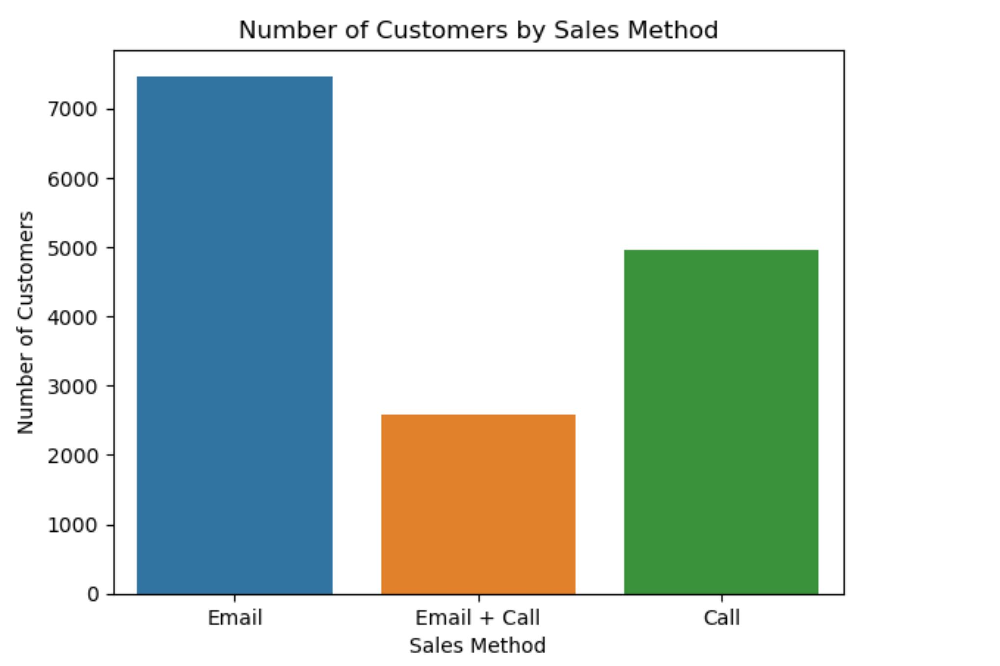
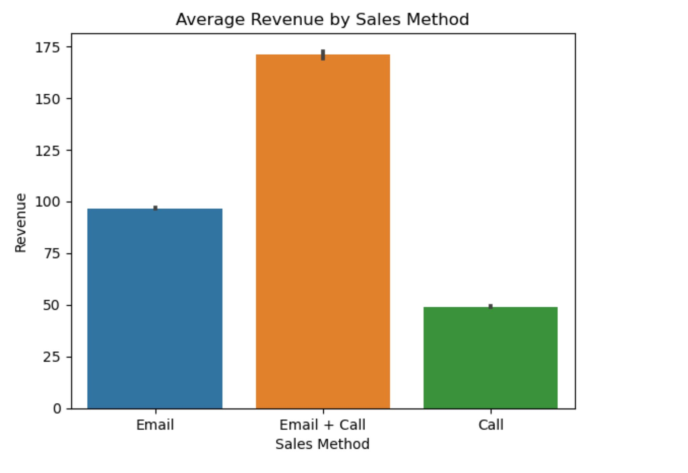
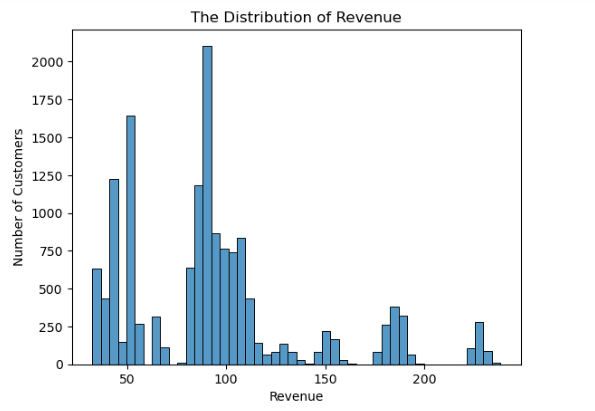
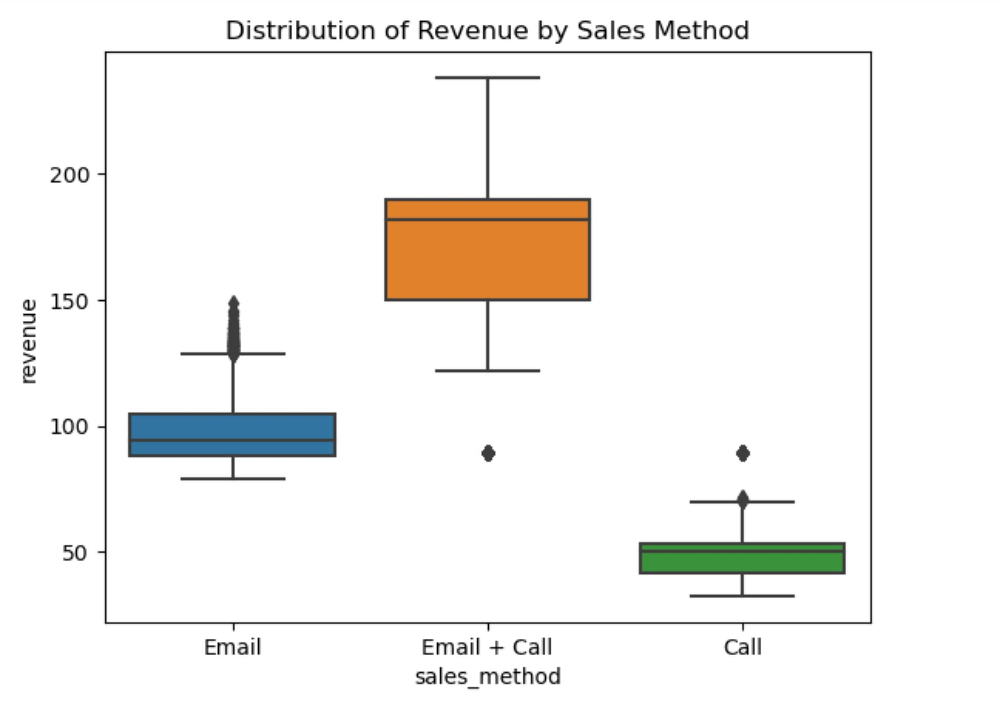
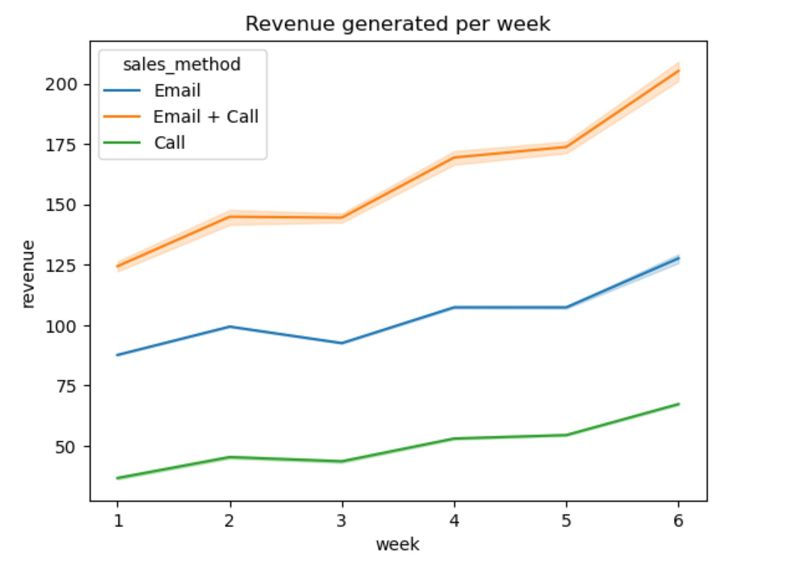
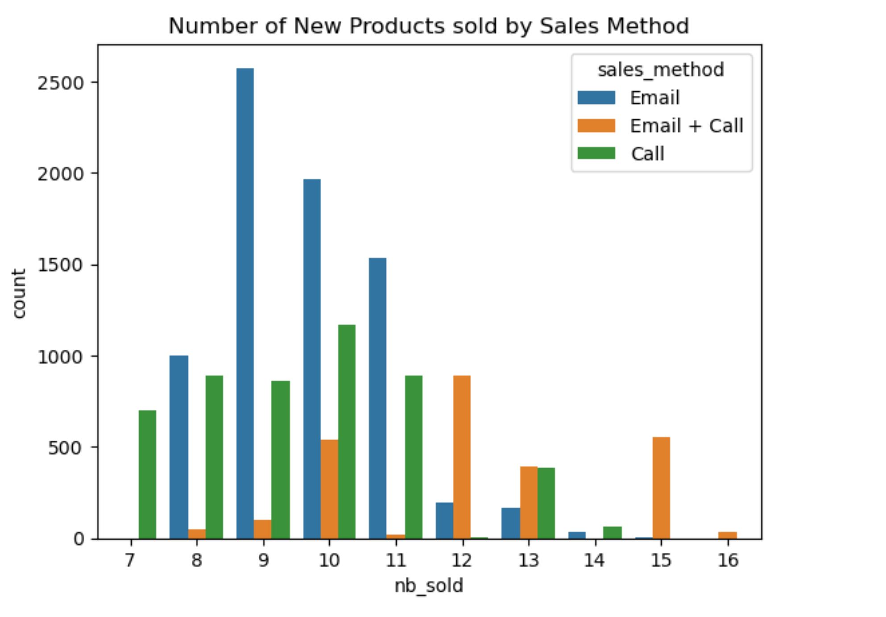
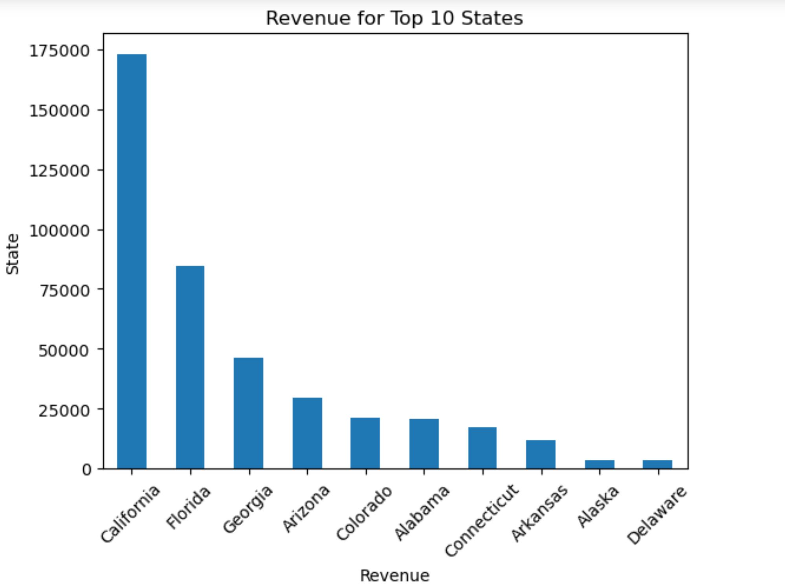

# Product-Sales-Pens-And-Printers
A Python project on the sales analysis for the pens and printers organization

## Introduction
This is a Python project on sales analysis of an imaginary store called Pens and Printers. The project is to analyze and derive insights to answer business questions which in turn will lead to the store making data-driven decisions.
**_Disclaimer_**: **_All datasets and reports do not represent any company, institution, or country. This is a dummy dataset to demonstrate the capabilities of Python_**.

## Skills / Concepts Demonstrated
The following Python libraries and skills were incorporated:
Numpy, Pandas, Matplotlib, Seaborn, importation and cleaning, exploratory analysis, data manipulation, statistics, and data visualizations.

## Problem statement
Pens and Printers' mission is to provide high-quality office products for large organizations. They prioritize rolling over new products expeditiously to their clients before their competitors.
Due to the high expectations of their clients and their ever-changing approach to purchasing new products, the sales team wants to focus on the best sales method not only to increase productivity but also to increase their revenue. The sales team wants to identify the following using data on the previous launch:
- Number of customers for each approach
- Spread of revenue overall and for each sales method
- The difference in revenue over time for each sales method
- Differences in customers for each group
- Recommendations

## Data Cleaning
The dataset contains 15000 rows and 8 columns before cleaning and validation. I have validated all the columns against the criteria in the dataset table:
- week: 6 numeric values without missing values. No cleaning needed
- sales_method: 5 categories identified. Replaced "em + call" and "email" with "Email + Call" and "Email" respectively. 3 categories remain.
- customer_id: 15000 unique values. No missing values. No cleaning needed
- nb_sold: Numeric values with no missing values. No cleaning needed
- revenue: 1074 missing values. Null values replaced with median value (89.5)
- years_as_customer: Rows 13741 and 13800 had the values 63 and 43 respectively which were errors because the Pens and Printers Company was founded in 1984. Values were replaced with 39 but will be communicated with the sales team.
- nb_site_visits: 27 numeric values. No missing values. No cleaning needed
- State: 50 unique states. No missing value or cleaning is needed.

After the data validation, the dataset contains 15000 rows and 8 columns without missing values.

# Exploratory Analysis
## How many customers were there for each approach?
Based on the data from the last new product launch, the Email approach had the highest number of customers (7466) which makes up almost 50% of the total number of customers. It was followed by the Call approach (4962) which made up 33% of the total number of customers and the Email + Call approach (2572) with 17% of the total number of customers.

The next visualization will identify if these numbers are directly proportional to the revenue each method generated.

## Average Revenue by Sales Method
The Email + Call sales method had the highest average revenue (170.88) which is almost twice the average generated by the Email sales method (96.57) and almost four times that of the Call method (49.13) even though it had the least number of customers.
This shows that a lot more customers are likely to purchase a lot more or higher value products when the Email + Call sales method is used.

## What does the spread of the revenue look like overall? And for each method?
From the histogram below, we can see the majority of the revenue generated by customers was 185.6 and below. Anything above this value could be considered an outlier.

## Distribution of Revenue by Sales Method
From the boxplots, we can see that the revenue generated by the customers from the Email + Call sales method is significantly higher than the others.
This again confirms that the Email + Call sales method has the potential to generate a lot more revenue if a lot of focus was placed on it.

## Was there any difference in revenue over time for each of the methods?
From the line plot, we can see upon release that the revenue generated from the Email + Call sales method has the highest revenue starting point and the highest growth rate over the six weeks compared to the other two sales methods.
- Email + Call: 124 – 205
- Email: 87.6 – 127.6
- Call: 36.6 – 67.25

## Number of new products sold by Sales Method
Based on the data, customers that buy the products due to the Email + Call approach tend to buy a lot more products in one purchase than the other sales methods.
This can be an indication as to why the average revenue generated is the highest even though the number of customers contacted is the lowest.

# Best Sales Method for launch
Based on the findings in the data, the Email + Call sales method is the best approach we should focus on. The reasons being
It has the highest average revenue even with having the lowest number of customers by far
It has the highest growth rate within the first six weeks of the release of a new product.

# Business Metrics
Since the goal is to increase both the revenue and identify the most efficient sales method to focus on, I recommend we go with two metrics: the percentage of the number of customers to the total and the percentage of revenue to the total revenue with respect to the Email + Call approach. This will be done for the first 6 weeks of the new product launch.

Based on previous data, the Email + Call sales method had 17% of the total number of customers and 31% of the total revenue. Therefore if the numbers increase after six weeks of the launch of the new product, it indicates a good sign of achieving our goal.

# Recommendation
For the following weeks, my recommendation will be:
- Increase the number of customers by using the Email + Call sales method.
- If there’ll be an overload or a threat of efficiency, reduce the emphasis on the Call only method since it doesn’t bring as much revenue but it has a higher number of customers as compared to the Email + Call sales method.
- Use the 2 key metrics to monitor whether there’s a strong sign for revenue growth even with a reduction of the other 2 sales methods.
- A lot of focus should be on the top 10 states with respect to the Email + Call sales method.

Data Quality
- Information on the types of products purchased by the customers of the various sales methods will be helpful for further analysis.
- The time spent on phone calls can be included to see if it plays a role as to why the Calls only sales method has very low revenue generation compared to the two.

